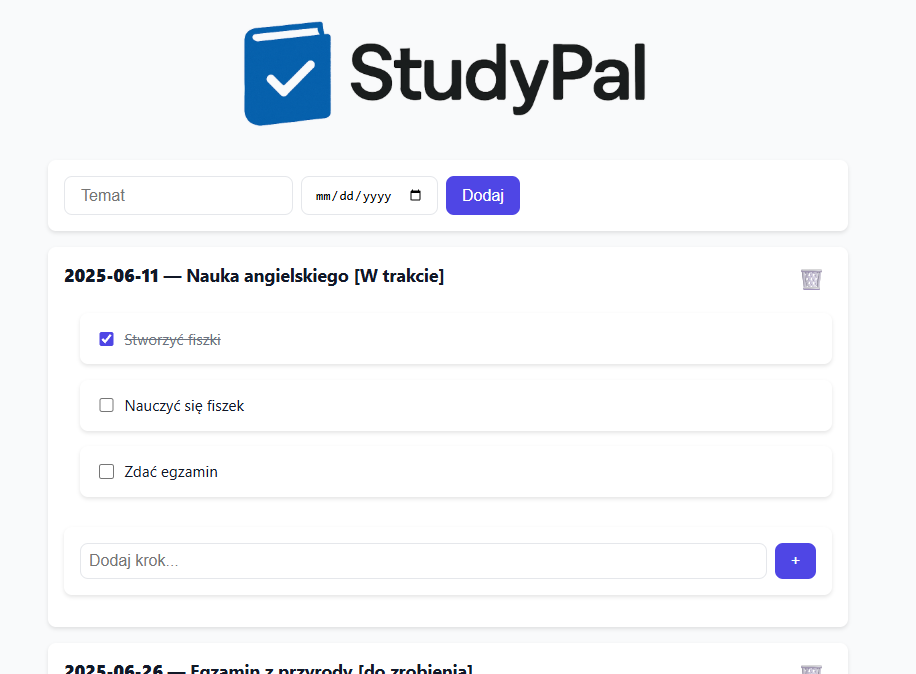

# 📚 StudyPal

A lightweight web application for creating and managing study plans with step checklists.

## ✨ Features

- 📆 Add study plans with a title and a date
- ✅ Add steps with checkboxes to each plan
- 🚦 Plan status updates automatically:
  - **Do zrobienia** – no steps completed
  - **W trakcie** – some steps completed
  - **Zrobione** – all steps completed
- 🗑️ Delete plans or individual steps
- 🎨 Clean and responsive UI (vanilla CSS)

## 🚀 Technologies Used

- **Node.js** + **Express.js**
- **SQLite** (via `sqlite3`)
- **Vanilla JS**
- **HTML/CSS**

## 🛠️ Setup Instructions

### 1. Clone the repo

```bash
git clone https://github.com/JakubKorytko/StudyPal.git
cd StudyPal
```

### 2. Install dependencies

```bash
yarn install
```

### 3. Run the app

```bash
yarn start
```

Open your browser at:  
📍 `http://localhost:3000`

## 📁 Project Structure

```
.
├── server.js         # Express + SQLite backend
├── public/
│   ├── index.html    # Frontend UI
│   ├── app.js        # Client-side logic
│   └── style.css     # CSS styling
└── README.md
```

## 🧠 Plan Status Logic

The app determines plan status automatically based on checkbox completion:

| Steps Completed | Status       |
| --------------- | ------------ |
| 0 / N           | Do zrobienia |
| 1..N-1 / N      | W trakcie    |
| N / N           | Zrobione     |

## 📸 Screenshot



## 📝 License

MIT — free to use and modify.
